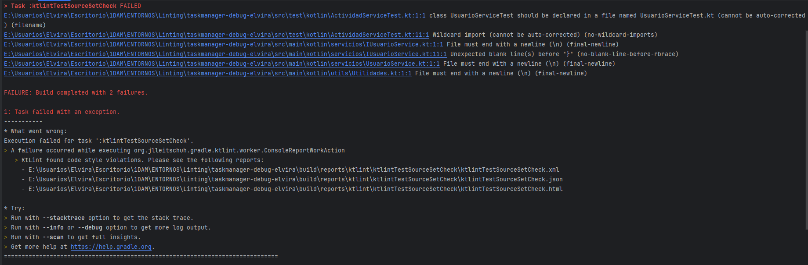
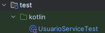
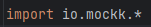

# TaskManager - Linting con Ktlint

1. Instalar la herramienta elegida (Detekt o Ktlint) e incluir capturas de pantalla del proceso.
    
Estoy usando Ktlint, para instalarlo he incluido en el fichero de build.gradle lo siguiente:
   

2. Integrar el analizador en el proyecto que se está desarrollando y ejecutar el análisis.

Para ejecutar el diagnóstico abro la terminal que el mismo IDE proporciona y ejecuto el siguiente comando:

   ./gradlew ktlintCheck

3. Identificar al menos 5 tipos de errores detectados.

He obtenido los siguientes errores

4. Para cada tipo de error, documentar:

Los errores que me está indicando son:

- class UsuarioServiceTest should be declared in a file named UsuarioServiceTest.kt

   Solución: Debo cambiarle el nombre porque me equivoqué y le puse Actividad en vez de Usuario porque al principio iba a hacer la actividad anterior con actividad.

-  Wildcard import en ActividadServiceTest
   
   Solución: Esto quiere decir que he hecho un import *, para que sea más controlado se recomienda importar solo lo necesario.

    Imagen de los imports antes:

    

    Imagen de los imports arreglados:

    |[Imports actuales](./src/main/kotlin/images/importdespues.png)

- File must end with a newline en IUsuarioService, en UsuarioService y en Utilidades

   Solución: Los archivos tienen que terminar con un salto de línea. Así que para arreglarlo añadiré un salto de líneas a todos los archivos.

- Unexpected blank line(s) before "}"

   Solución: He dejado un espacio antes de llave en la clase IUsuarioService, así que lo eliminaré.

He vuelto a ejecutar el analizador de código y me ha dado un error:

- File must end with a newline (\n) (final-newline) en build.gradle.kts

    Solución: añadirle un espacio final

5. Explorar y modificar al menos una opción de configuración del analizador distinta de la predeterminada; describir cómo afecta al código y por tanto al informe de errores.

He añadido esta linea en el archivo build.gradle.kts

    disabledRules.set(setOf("no-wildcard-imports"))

Esto lo que hace es que no me saltaría como error los wildcard import.

En mi caso me saltaba porque Kotlin prefiere imports más específicos como ya he explicado antes, después de la modificación el informe de error los obviaría.