# TaskManager - Code Smell y Refactorización

1. Ejecución del analizador de código del IDE

Para ejecutar el analizador de código del IDE le he dado click derecho a la carpeta raiz del proyecto y he seleccionado Analyze > Inspect Code

Localización de code smell y patrones de refactorización:

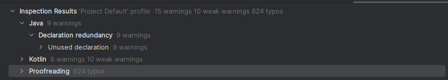

- Imports no usados

  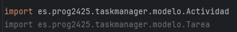

- Propiedades que pueden ser privadas

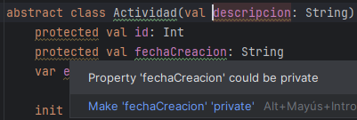

- Funciones que no se utilizan por cambios en la lógica del código

- Función que puede ser convertida a un assignment.

Esto quiere decir que en vez de usar un condicional, puedo asignarlo directamente ya que no es necesaria la estructura de control.

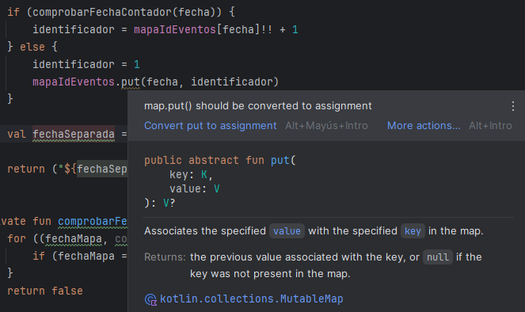

Solucionado:

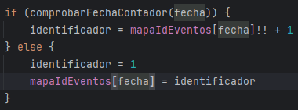

2. Aplicación de refactorizaciones

- Extracción de método

En el menú al seleccionar la opción de crear evento tenía una función que desde los parámetros pedía la información llamando a otras funciones.

Así estaba el código antes de refactorizar:

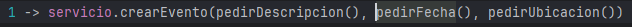

Esto puede ser un poco engorroso y poco entendible, así que lo he extraído a un método para que quede mucho más simple que es el de crearEvento() aprovechando para utilizar datos de actividades que lo explico después.

Código refactorizado:

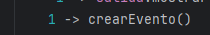

- Introducir parámetro objeto

Antes para crear un evento pedía los datos por separado solicitando a través de métodos como pedirDescripcion(), pedirFecha() y pedirUbicacion(), lo cual generaba un código más extenso, más lioso y menos reutilizable.

|[Código antes de refactorizarlo](./src/main/kotlin/images/parametroPorObjeto.png)

Para refactorizarlo he creado una data class que contiene los parámetros que tiene que tener el evento:

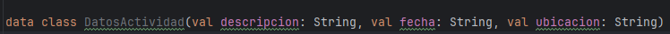

Además me he creado la función pedirDatosActividad() que agrupa las llamadas a las funciones individuales y devuelve una instancia de DatosActividad.

Así quedaría el código después utilizando la data class y la función refactorizada:

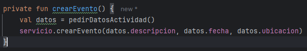

- Simplificar condicional

Tenía una función con un if muy largo que hacía  if (numeroTarea in 1..tareas.size) lo he reemplazado con getOrNull(numeroTarea - 1) para que sea más eficiente.

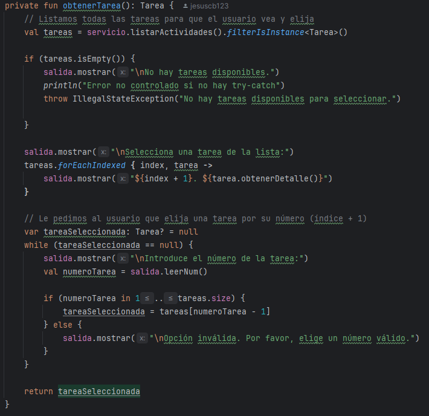

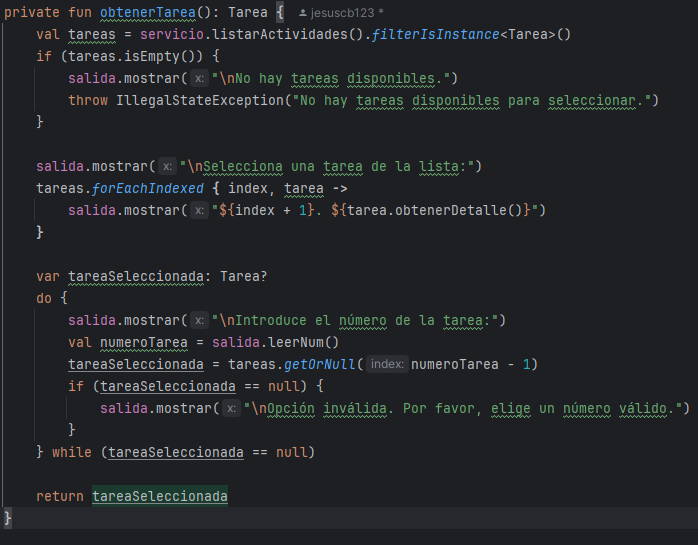

3. Respuestas:

[1]
1.a ¿Qué code smell y patrones de refactorización has aplicado?

En el punto anterior -> Introducir parámetro objeto (explicado punto 2)
- Code smell: Long Parameter List
- Patrón de refactorización: Introducir parámetro objeto

En el punto anterior -> Simplificación condicional (explicado punto 2)
- Code Smell: Long Conditional
- Patrón de refactorización: Simplificar expresión condicional

En el punto anterior -> Extracción de método (explicado punto 2)
- Code Smell: Long Method y Divergente Change (la función hacía muchas cosas)
- Patrón de refactorización: Extract Method

1.b Teniendo en cuenta aquella funcionalidad que tiene pruebas unitarias, selecciona un patrón de refactorización de los que has aplicado y que están cubierto por los test unitarios. ¿Porque mejora o no mejora tu código? Asegurate de poner enlaces a tu código

Todas las refactorizaciones que he realizado tienen como objetivo hacer mi código más legible, haciéndolo más sintáctico, que sea más mantenible y reutilizable al haber extraído métodos...

[2]
2.a Describe el proceso que sigues para asegurarte que la refactorización no afecta a código que ya tenias desarrollado.

He ido haciendo los cambios progresivamente, por ejemplo al crear la función de crearEvento() para reemplazar los parámetros que pedía por los de pedirDatosActividad() voy cambiando los parámetros manualmente en todos los sitios que lo necesite.

Después cambio todas las llamadas que estén utilizando esa función.

Ejecuto el programa para ver que no tenga fallos de compilación que se me hayan podido pasar.

Podría haber hecho pruebas unitarias, pero la verdad que no me han salido, así que he comprobado manualmente si las validaciones se hacen correctamente (introduciendo mal los datos por consola).

[3]
3.a ¿Que funcionalidad del IDE has usado para aplicar la refactorización seleccionada? Si es necesario, añade capturas de pantalla para identificar la funcionalidad.

Una vez que apliqué el analizador de código como expliqué al principio, este me mostraba lo que se podía refactorizar y pulsándo sobre la sugerencia te llevaba al fragmento de código.

Directamente ahí te ponías encima de lo que querías refactorizar y te daba una opción para hacerlo automático.