# TaskManager -Documentación

1. Documentar mi código

Para documentar mi código lo hice con el formato multilinea o comentario en bloque (/*), aunque también hemos documentado en otras ocasiones con docstring(""")

En ella incluía una breve descripción de la función, parámetros recibidos, retornos que hacía. A continuación adjunto capturas de mi código comentado:

Capturas del servicio Usuario comentado:

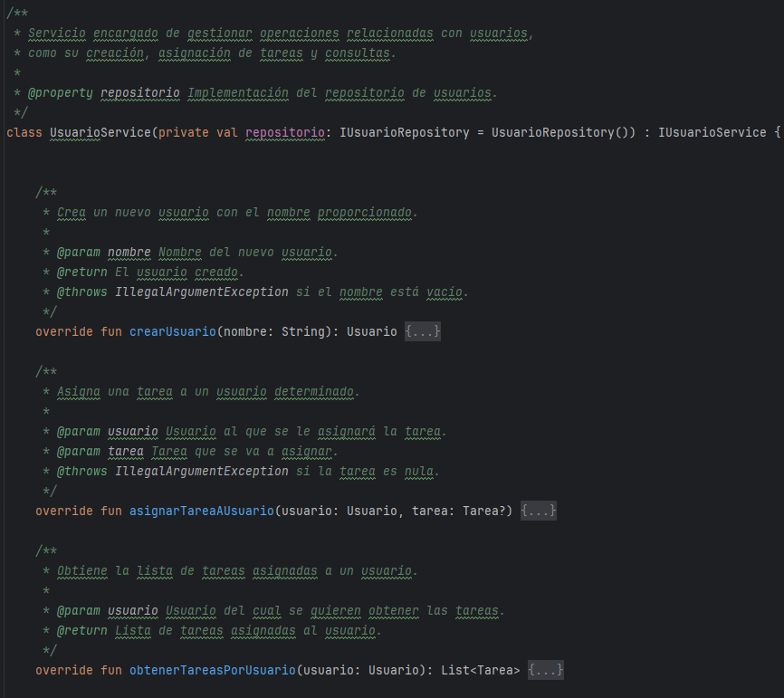

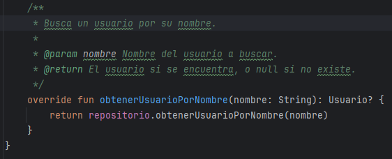

Capturas del servicio Actividad comentado:

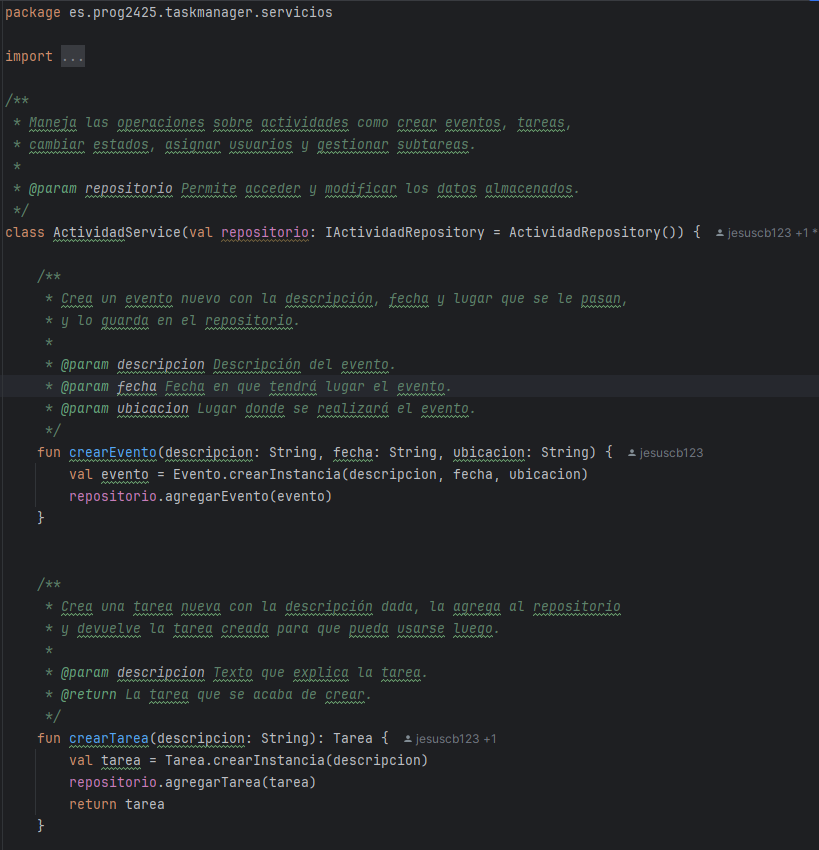

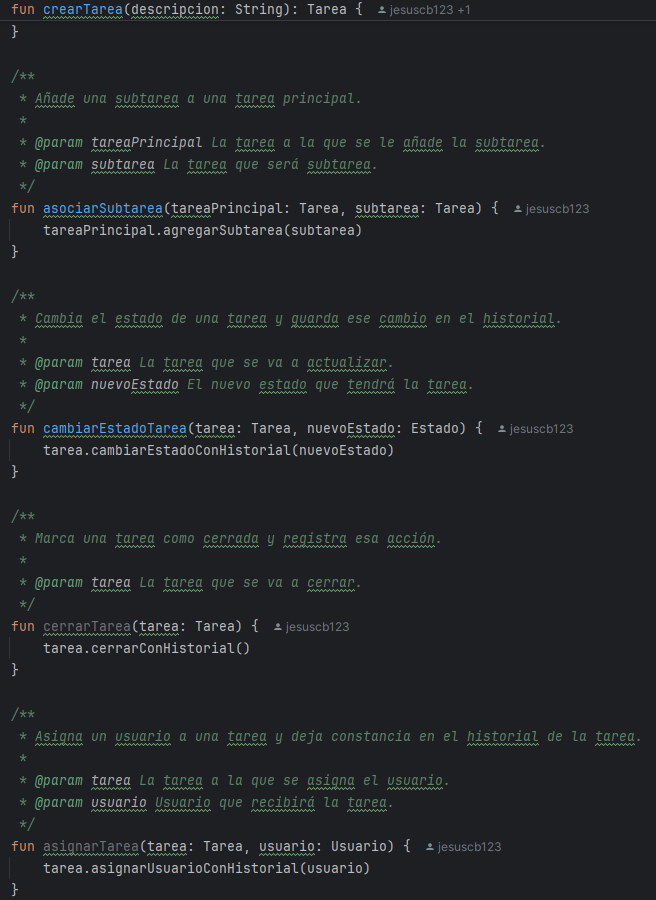

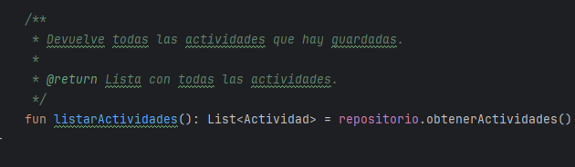

Capturas del servicio Gestor Actividades comentado:

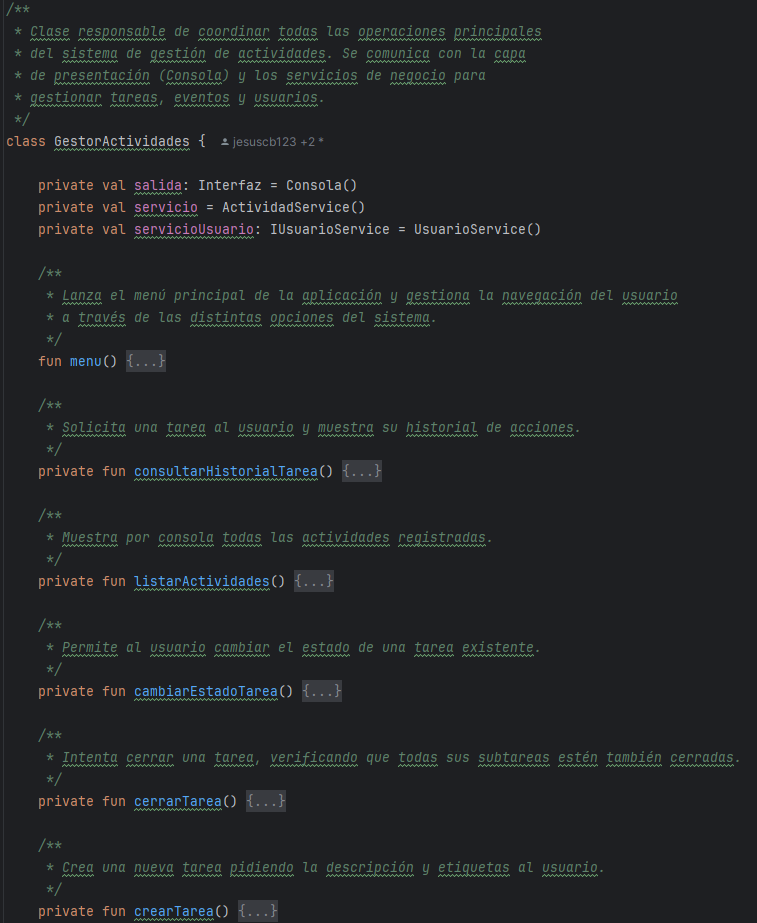

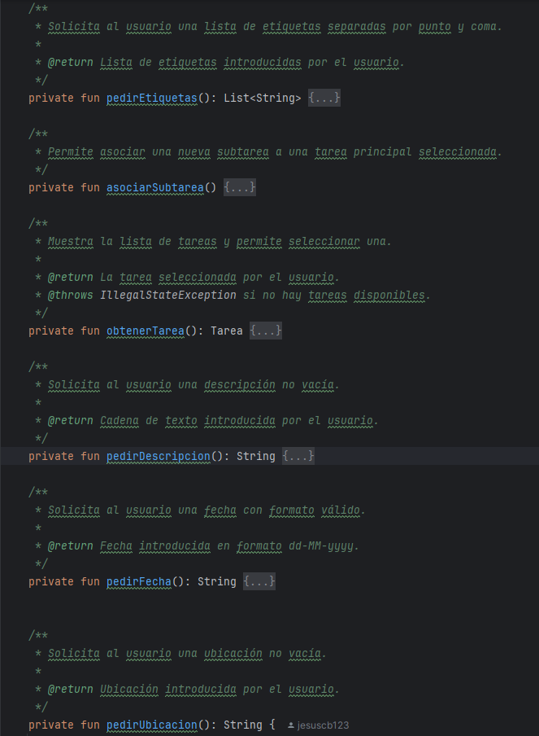

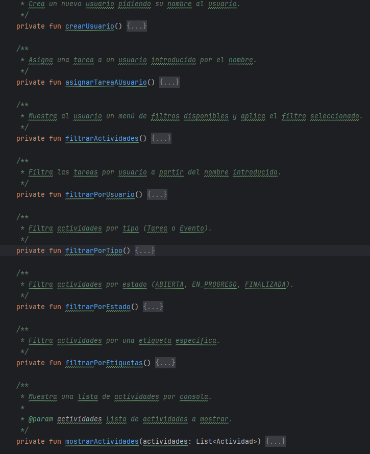

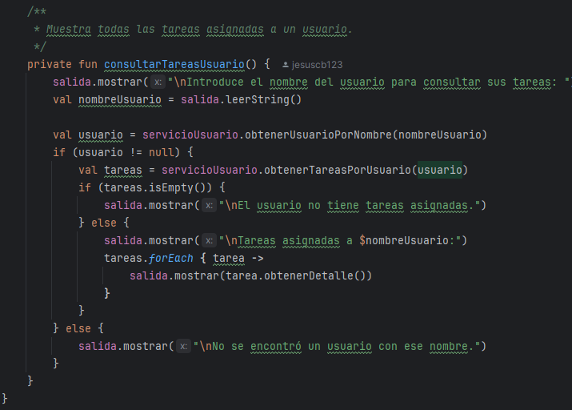

1. Configuración de Dokka

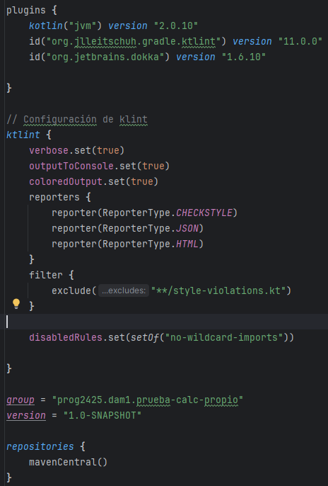

Para configurar Dokka incluí en el archivo build.gradle.kts lo siguiente:

plugins {
id("org.jetbrains.dokka") version "1.6.10"
}

repositories {
mavenCentral()
}

Sin embargo en mi versión de Gradle daba problemas y al ejecutar me daba error, entonces la versión la sustituí por "1.9.20" que es una versión más actual.

2. Ejecución de Dokka

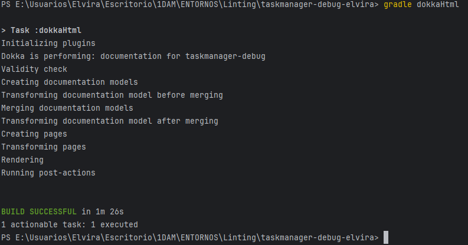

Después ejecuté Dokka a través del comando "gradle dokkaHtml" para generar un html con la documentación-

3. Ruta de Dokka

Al ejecutarlo se me creó en el build una carpeta de dokka con el html y todo lo necesario:

Esta es la ruta generada: build/dokka/html/index.html

Ejemplos de cómo se ve Dokka en el navegador:

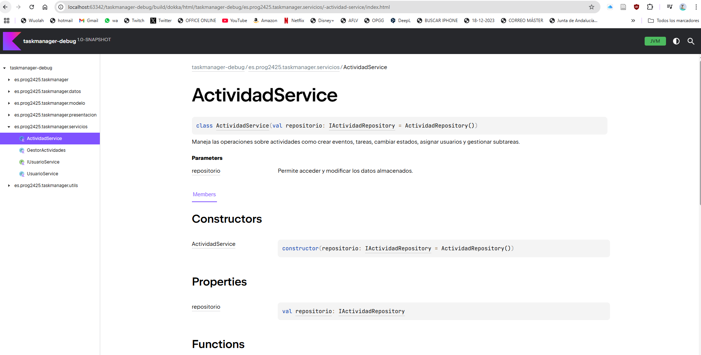

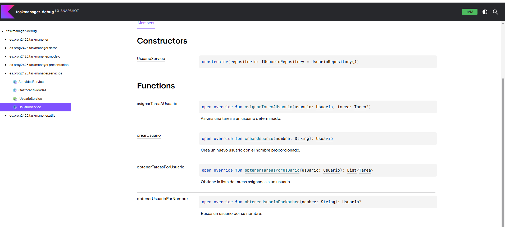
