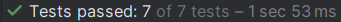

# TaskManager - Pruebas unitarias

** 1. Selección del servicio **

He elegido mi servicio UsuarioService, en este caso no tenía el repositorio inyectado en el constructor, pero lo he añadido para poder hacer los tests.

** 2. Identificación de métodos **

- Método crearUsuario(nombre: String): Usuario
Recibe un string que es el nombre del usuario que queremos crear y devuelve una instancia de usuario.

- Método asignarTareaAUsuario(usuario: Usuario, tarea: Tarea?)
Recibe por parámetros un usuario de tipo usuario y una tarea que puede ser nula. Asignará la tarea al usuario si la tarea no es nula.

- Método obtenerTareasPorUsuario(usuario: Usuario): List<Tarea>
Recibe por parámetros un usuario de tipo usuario para buscar las tareas que tiene asignada y devuelve una lista de tareas.

- Método obtenerUsuarioPorNombre(nombre: String): Usuario?

Recibe un string con el nombre del usuario a buscar y devuelve la instancia de usuario correspondiente o nulo si no existe.

** 3. Diseño de casos de prueba

| Método                       | Caso de prueba                      | Estado inicial del mock               | Acción                                        | Resultado esperado                                             |
|-----------------------------|-----------------------------------|-------------------------------------|-----------------------------------------------|---------------------------------------------------------------|
| crearUsuario(nombre)         | Nombre válido                     | mockRepositorio acepta usuario      | llamar crearUsuario("Elvira")                 | Retorna instancia de Usuario, mockRepositorio.agregarUsuario llamado |
| crearUsuario(nombre)         | Nombre vacío                     | -                                   | llamar crearUsuario("")                       | Lanza IllegalArgumentException                                |
| asignarTareaAUsuario(usuario, tarea) | Tarea válida                     | tarea mock permite asignar usuario  | llamar asignarTareaAUsuario(usuario, tarea)   | tarea.asignarUsuario y usuario.asignarTarea llamados con tarea  |
| asignarTareaAUsuario(usuario, tarea) | Tarea nula                       | -                                   | llamar asignarTareaAUsuario(usuario, null)    | Lanza IllegalArgumentException                                    |
| obtenerTareasPorUsuario(usuario) | Usuario con tareas asignadas       | usuario mock devuelve lista de tareas | llamar obtenerTareasPorUsuario(usuario)       | Devuelve lista de tareas obtenida desde usuario                |
| obtenerTareasPorUsuario(usuario) | Usuario sin tareas asignadas       | usuario mock devuelve lista vacía   | llamar obtenerTareasPorUsuario(usuario)       | Devuelve lista vacía                                           |
| obtenerUsuarioPorNombre(nombre) | Usuario existente en repositorio   | mockRepositorio devuelve usuario    | llamar obtenerUsuarioPorNombre("Lucía")       | Devuelve el usuario mockeado                                  |
| obtenerUsuarioPorNombre(nombre) | Usuario inexistente en repositorio | mockRepositorio devuelve null       | llamar obtenerUsuarioPorNombre("Desconocido") | Devuelve null                                                |

** 4. Implementación de los tests

    describe("Crear usuario") {
        it("Debe crear un usuario y agregarlo al repositorio") {
            val nombre = "Elvira"
            val usuario = usuarioService.crearUsuario(nombre)

            usuario.nombre shouldBe nombre
            verify { mockRepositorio.agregarUsuario(usuario) }
        }

        it("Debe lanzar excepción si el nombre está vacío") {
            val nombreVacio = ""
            shouldThrow<IllegalArgumentException> {
                usuarioService.crearUsuario(nombreVacio)
            }
        }
    }

    describe("Asignar tarea a usuario") {
        it("Debe asignar la tarea al usuario") {
            val usuario = mockk<Usuario>(relaxed = true)
            val tarea = mockk<Tarea>(relaxed = true)

            usuarioService.asignarTareaAUsuario(usuario, tarea)

            verify { tarea.asignarUsuario(usuario) }
            verify { usuario.asignarTarea(tarea) }
        }

        it("Debe lanzar una excepción si la tarea es nula") {
            val usuario = mockk<Usuario>(relaxed = true)
            val tarea: Tarea? = null

            shouldThrow<IllegalArgumentException> {
                usuarioService.asignarTareaAUsuario(usuario, tarea)
            }
        }
        }

    describe("Obtener tareas por usuario") {
        it("Debe devolver la lista de tareas del usuario") {
            val usuario = mockk<Usuario>()
            val tareasMock = listOf(mockk<Tarea>(), mockk<Tarea>())

            every { usuario.obtenerTareasAsignadas() } returns tareasMock

            val resultado = usuarioService.obtenerTareasPorUsuario(usuario)

            resultado shouldContainExactly tareasMock
        }
    }

    describe("Obtener usuario por nombre") {
        it("Debe devolver el usuario si existe") {
            val nombre = "Lucía"
            val usuarioMock = mockk<Usuario>()

            every { mockRepositorio.obtenerUsuarioPorNombre(nombre) } returns usuarioMock

            val resultado = usuarioService.obtenerUsuarioPorNombre(nombre)

            resultado shouldBe usuarioMock
        }

        it("Debe devolver null si no existe el usuario") {
            val nombre = "Desconocido"

            every { mockRepositorio.obtenerUsuarioPorNombre(nombre) } returns null

            val resultado = usuarioService.obtenerUsuarioPorNombre(nombre)

            resultado shouldBe null
        }
    }

** 5. Ejecución y reporte de resultados

Adjunto una imagen de los test pasados correctamente y el tiempo que ha tardado en hacerlos:

