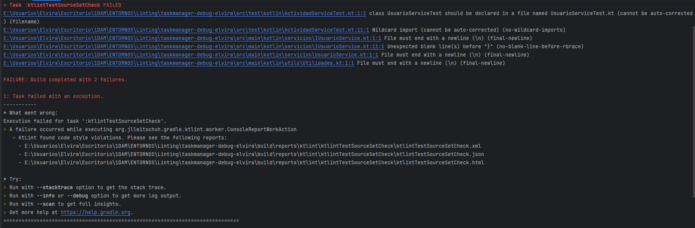

# TaskManager - Linting con Ktlint

1. Estoy usando Ktlint, para instalarlo he incluido en el fichero de build.gradle lo siguiente:
   

2. Para ejecutar el diagnóstico abro la terminal que el mismo IDE proporciona y ejecuto el siguiente comando:

   ./gradlew ktlintCheck

3. He obtenido los siguientes errores:

Los errores que me está indicando son:

- class UsuarioServiceTest should be declared in a file named UsuarioServiceTest.kt

   Debo añadirle la extensión .kt a ese archivo

-  Wildcard import en ActividadServiceTest
   
   Esto quiere decir que he hecho un import *, para que sea más controlado se recomienda importar solo lo necesario.

- File must end with a newline en IUsuarioService, en UsuarioService y en Utilidades

   Los archivos tienen que terminar con un salto de línea. Así que para arreglarlo añadiré un salto de líneas a todos los archivos.

- Unexpected blank line(s) before "}"

   He dejado un espacio antes de llave en la clase IUsuarioService, así que lo eliminaré.

