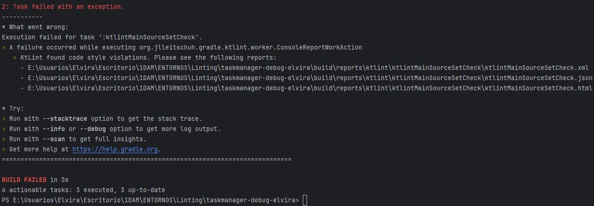

# TaskManager - Linting con Ktlint

1. Estoy usando Ktlint, para instalarlo he incluido en el fichero de build.gradle lo siguiente:
   

2. Para ejecutar el diagnóstico abro la terminal que el mismo IDE proporciona y ejecuto el siguiente comando:

   ./gradlew ktlintCheck

3. He obtenido los siguientes errores:

Los errores que me está indicando son:

- class UsuarioServiceTest should be declared in a file named UsuarioServiceTest.kt

   Solución: Debo cambiarle el nombre porque me equivoqué y le puse Actividad en vez de Usuario porque al principio iba a hacer la actividad anterior con actividad.

-  Wildcard import en ActividadServiceTest
   
   Solución: Esto quiere decir que he hecho un import *, para que sea más controlado se recomienda importar solo lo necesario.

    Imagen de los imports antes:

    

    Imagen de los imports arreglados:

    |[Imports actuales](./src/main/kotlin/images/importdespues.png)

- File must end with a newline en IUsuarioService, en UsuarioService y en Utilidades

   Solución: Los archivos tienen que terminar con un salto de línea. Así que para arreglarlo añadiré un salto de líneas a todos los archivos.

- Unexpected blank line(s) before "}"

   Solución: He dejado un espacio antes de llave en la clase IUsuarioService, así que lo eliminaré.

He vuelto a ejecutar el analizador de código y me ha dado un error:

- File must end with a newline (\n) (final-newline) en build.gradle.kts

    Solución: añadirle un espacio final